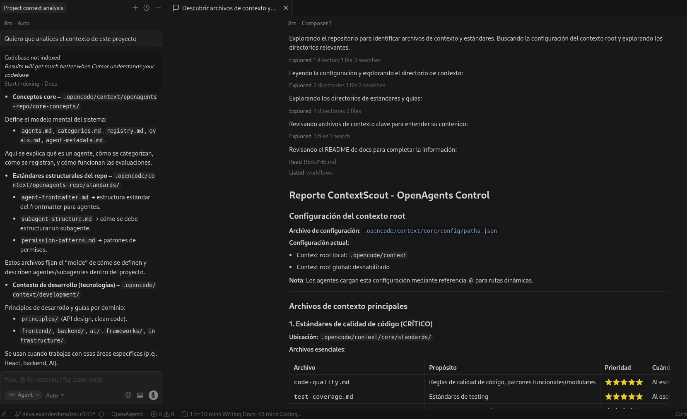
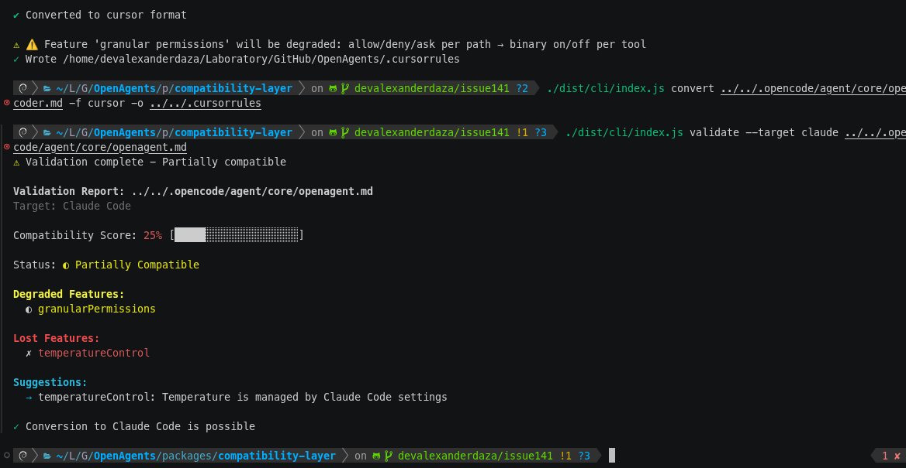

# @openagents-control/compatibility-layer

> Compatibility layer for converting OpenAgents Control agents to/from other AI coding tools

[](https://opensource.org/licenses/MIT)
[](https://www.typescriptlang.org/)
[](https://nodejs.org/)

## Overview

This package provides bidirectional conversion between OpenAgents Control (OAC) agent format and various AI coding tools:

- **Cursor IDE** - VSCode-based AI editor with `.cursorrules`
  [](./docs/migration-guides/oac-to-cursor.md)
- **Claude Code** - Anthropic's official CLI with `config.json` and `agents/*.md`
  [](./docs/migration-guides/oac-to-claude.md)
- **Windsurf** - AI-powered development environment with JSON config

## Features

- ✅ **Bidirectional conversion** - Convert OAC ↔ Tool formats
- ✅ **Feature parity tracking** - Know what's supported in each tool
- ✅ **Graceful degradation** - Handle unsupported features with warnings
- ✅ **CLI tool** - Easy conversion from command line
- ✅ **Batch migration** - Migrate entire projects at once
- ✅ **Type-safe** - Full TypeScript with Zod validation
- ✅ **Extensible** - Plugin architecture for new tools

## Installation

```bash
# npm
npm install @openagents-control/compatibility-layer

# pnpm
pnpm add @openagents-control/compatibility-layer
```

## Quick Start

### CLI Usage

```bash
# Convert a single file
oac-compat convert agent.md -f cursor -o .cursorrules

# Convert with auto-detection of source format
oac-compat convert .cursorrules -f oac -o agent.md

# Validate compatibility before conversion
oac-compat validate agent.md -t claude --strict

# Migrate entire project
oac-compat migrate ./agents -f claude --out-dir ./output

# Preview migration without writing files
oac-compat migrate ./agents -f windsurf --dry-run

# Show platform capabilities
oac-compat info cursor

# Compare two platforms
oac-compat info cursor --compare claude
```

### Programmatic Usage

```typescript
import {
  loadAgent,
  getAdapter,
  translate,
  analyzeCompatibility,
} from "@openagents-control/compatibility-layer";

// Load an OAC agent
const agent = await loadAgent("./agent.md");

// Check compatibility with target platform
const compatibility = analyzeCompatibility(agent, "cursor");
console.log("Compatible:", compatibility.compatible);
console.log("Warnings:", compatibility.warnings);
console.log("Blockers:", compatibility.blockers);

// Convert to another format
const adapter = getAdapter("claude");
const result = await adapter.fromOAC(agent);

if (result.success) {
  for (const config of result.configs) {
    console.log(`File: ${config.fileName}`);
    console.log(config.content);
  }
}

// Or use the translate function for quick conversion
const translated = translate(agent, "cursor");
```

## CLI Commands

### `convert` - Convert a single file

```bash
oac-compat convert <input> -f <format> [options]

Options:
  -f, --format <format>   Target format (oac, cursor, claude, windsurf)
  -o, --output <path>     Output file path (stdout if omitted)
  --from <format>         Source format (auto-detect if omitted)
  --force                 Overwrite existing output file
```

### `validate` - Check compatibility

```bash
oac-compat validate <input> -t <format> [options]

Options:
  -t, --target <format>   Target format to validate against
  --strict                Enable strict validation mode
```

### `migrate` - Batch migration

```bash
oac-compat migrate <source-dir> -f <format> [options]

Options:
  -f, --format <format>   Target format
  -o, --out-dir <path>    Output directory
  --dry-run               Preview without writing files
  --force                 Overwrite existing files
```

### `info` - Platform information

```bash
oac-compat info [platform] [options]

Options:
  -d, --detailed          Show detailed capability information
  -c, --compare <other>   Compare with another platform
```

### Global Options

```bash
-v, --verbose             Enable verbose output
-q, --quiet               Suppress all output except errors
--output-format <format>  Output format (text, json)
```

## Feature Parity Matrix

| Feature              | OAC      | Cursor     | Claude | Windsurf |
| -------------------- | -------- | ---------- | ------ | -------- |
| **Config Format**    | YAML+MD  | Plain text | JSON   | JSON     |
| **Multiple Agents**  | ✅       | ❌         | ✅     | ✅       |
| **Tool Permissions** | Granular | Binary     | Binary | Binary   |
| **Temperature**      | ✅       | ❌         | ❌     | ✅       |
| **Skills/Contexts**  | ✅       | ❌         | ✅     | ⚠️       |
| **Hooks**            | ✅       | ❌         | ✅     | ❌       |
| **Model Selection**  | ✅       | ✅         | ✅     | ✅       |

See [Feature Matrices](docs/feature-matrices.md) for detailed comparison.

## Migration Guides

- [Cursor → OAC](docs/migration-guides/cursor-to-oac.md) - Import from Cursor
- [Claude → OAC](docs/migration-guides/claude-to-oac.md) - Import from Claude Code
- [OAC → Cursor](docs/migration-guides/oac-to-cursor.md) - Export to Cursor
- [OAC → Claude](docs/migration-guides/oac-to-claude.md) - Export to Claude Code
- [OAC → Windsurf](docs/migration-guides/oac-to-windsurf.md) - Export to Windsurf

## API Reference

### Agent Loading

```typescript
import {
  loadAgent,
  loadAgents,
  AgentLoader,
} from "@openagents-control/compatibility-layer";

// Load single agent
const agent = await loadAgent("./agent.md");

// Load all agents from directory
const agents = await loadAgents("./agents/");

// Using the loader class
const loader = new AgentLoader();
const agent = await loader.loadFromFile("./agent.md");
```

### Adapter Registry

```typescript
import {
  registry,
  getAdapter,
  listAdapters,
} from "@openagents-control/compatibility-layer";

// Get adapter by name
const adapter = getAdapter("cursor");

// List all adapters
const names = listAdapters(); // ['cursor', 'claude', 'windsurf']

// Get all capabilities
const capabilities = getAllCapabilities();
```

### Translation Engine

```typescript
import {
  translate,
  previewTranslation,
  TranslationEngine,
} from "@openagents-control/compatibility-layer";

// Quick translate
const result = translate(agent, "cursor");

// Preview without converting
const preview = previewTranslation(agent, "claude");
console.log("Features lost:", preview.featuresLost);
console.log("Features gained:", preview.featuresGained);

// Using the engine for more control
const engine = new TranslationEngine();
const result = engine.translate(agent, "windsurf", {
  preserveComments: true,
  strictMode: false,
});
```

### Mappers

```typescript
import {
  mapToolFromOAC,
  mapModelFromOAC,
  mapPermissionsFromOAC,
  mapContextPathFromOAC,
} from "@openagents-control/compatibility-layer";

// Map tool names
mapToolFromOAC("bash", "cursor"); // { name: 'terminal', exact: true }

// Map model identifiers
mapModelFromOAC("claude-sonnet-4", "cursor"); // { id: 'claude-3-sonnet', exact: true }

// Map permissions
mapPermissionsFromOAC({ bash: { "*": "allow" } }, "claude");
// { permissions: { bash: true }, warnings: [...] }
```

## Architecture

```
src/
├── types.ts              # Zod schemas and TypeScript types
├── index.ts              # Public API exports
├── core/
│   ├── AgentLoader.ts    # OAC agent file parser
│   ├── AdapterRegistry.ts # Adapter management
│   ├── CapabilityMatrix.ts # Feature compatibility
│   └── TranslationEngine.ts # Orchestrates conversion
├── adapters/
│   ├── BaseAdapter.ts    # Abstract base class
│   ├── CursorAdapter.ts  # Cursor IDE adapter
│   ├── ClaudeAdapter.ts  # Claude Code adapter
│   └── WindsurfAdapter.ts # Windsurf adapter
├── mappers/
│   ├── ToolMapper.ts     # Tool name translation
│   ├── ModelMapper.ts    # Model ID translation
│   ├── PermissionMapper.ts # Permission translation
│   └── ContextMapper.ts  # Context path translation
└── cli/
    ├── index.ts          # CLI entry point
    ├── types.ts          # CLI types
    ├── utils.ts          # CLI utilities
    └── commands/
        ├── convert.ts    # convert command
        ├── validate.ts   # validate command
        ├── migrate.ts    # migrate command
        └── info.ts       # info command
```

## Development

```bash
# Install dependencies
npm install

# Build
npm run build

# Run tests
npm test

# Test with coverage
npm run test:coverage

# Watch mode for development
npm run build:watch

# Lint
npm run lint
npm run lint:fix
```

## Creating Custom Adapters

```typescript
import {
  BaseAdapter,
  OpenAgent,
  ConversionResult,
  ToolCapabilities,
} from "@openagents-control/compatibility-layer";

class MyToolAdapter extends BaseAdapter {
  readonly name = "my-tool";
  readonly displayName = "My Tool";
  readonly version = "1.0.0";

  getCapabilities(): ToolCapabilities {
    return {
      supportsMultiAgent: false,
      supportsSkills: false,
      supportsHooks: false,
      supportsGranularPermissions: false,
      configFormat: "json",
    };
  }

  async toOAC(source: string): Promise<OpenAgent> {
    // Parse source and return OpenAgent
  }

  async fromOAC(agent: OpenAgent): Promise<ConversionResult> {
    // Convert OpenAgent to your format
    return {
      success: true,
      configs: [{ fileName: "config.json", content: "...", encoding: "utf-8" }],
      warnings: [],
    };
  }
}

// Register the adapter
import { registry } from "@openagents-control/compatibility-layer";
registry.register(new MyToolAdapter());
```

## Contributing

See [CONTRIBUTING.md](../../CONTRIBUTING.md) for guidelines.

## License

MIT © OpenAgents Control Contributors
